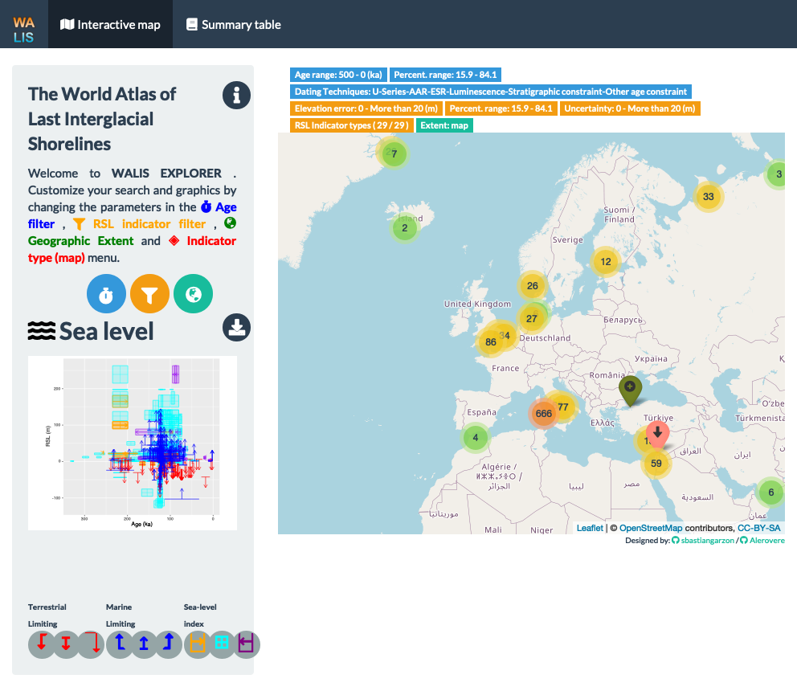

```{r, include=FALSE}
# Select an interactive or static version of the poster
# For interactive set interactive <- TRUE
# For an static set <- FALSE
interactive <- FALSE
```


```{r, include=FALSE}

knitr::opts_chunk$set(echo = FALSE,
                      warning = FALSE,
                      tidy = FALSE,
                      message = FALSE,
                      fig.align = 'center',
                      out.width = "100%")
options(knitr.table.format = "html") 
```
> DOI: [10.6084/m9.figshare.16601084](https://doi.org/10.6084/m9.figshare.16601084)

# Introduction

Standardization of sea-level indicators (SLI) has been one of the common goals of sea-level scientists to improve the sharing and discovery of new data. Recent efforts include the *World Atlas of Last Interglacial Shorelines (WALIS)*, a standardized database structure resulted from the WARMCOASTS project (ERC-StG 802414) with collaboration with PALSEA (a PAGES-INQUA working group). The database design proposed by @Rovere2020 includes more than 200 parameters allowing the insertion of data and metadata of different techniques as radiometric dating and sea level stratigraphy. 

Dozens of sea level researchers have contributed to populate the database as part of the ongoing Special Issue of the journal *Earth System Science Data*, resulting in a collection of more than 7.000 sea level indicators during the Last Interglacial. Beyond the advantages of standardization for interoperability of data from multiple research groups, sea-level model fitting, and reproducibility of research results, WALIS facilitates the development of interactive tools to explore sea-level data. In this regard, we present WALIS-Explorer, an R-Shiny application to visualize the sea-level index points and limiting data available in WALIS.

# Methods

**Individual elements**

{WALIS-explorer} was developed using `Shiny` [see @shiny2021], an R package designed to create interactive applications. This package allows the integration of multiple independent elements facilitating the creation of more interactive data visualizations. We use `Shiny` to combine three common sea-level indicators publication elements: maps, sea-level plots, and tables.

```{r figure-packages, out.width='100%', fig.cap='Main R packages used to develop the application'}
 
```

We generated the maps with `leaflet` [see @leaflet2021] using the spatial parameters (`lat` and `lon`) to display the distribution of SLI around the earth with relevant information of the indicator (e.g., `WALIS ID`, `Type of point` or `Dating method`). Sea level plot results from `ggplot2`[see @ggplot2-2016] after multiple filtering using the database structure proposed by @Rovere2020 to identify age and relative-sea level parameters for both limiting and sea-level index indicators. Additional information not recorded in the spatial or sea-level plots elements are filtered using `dplyr` [see @dplyr2021] and displayed using `DataTables` [see @dt2021].

**Interaction**

The interaction between the different elements responds to four main parameters of SLI: `Indicator type` (e.g., `Terrestrial limiting`), `Location`, Relative sea level (`RSL`), and `Age`. Each of these elements includes a filtering option in the Shiny app.

The filtering by `Indicator type` and `location` parameters result from the `leaflet` map as this element displays the data in the navigation area or by `Indicator type`. For example, only the SLI indicators in the navigation area (or the ones defined with the drawing tool) are included for sea-level plots or displayed in the table tab. For this process, `sf`  [see @pebesma2018] is used to create spatial queries to select only the SLI indicators in the area of interest. This selection updates every time the user changes the location in the `leaflet` map.

```{r figure-filters, out.width='100%', fig.cap='Different types of filters of sea level indicators in the application'}
  
```


The graphic elements of `Shiny` control the filtering by Relative sea level (`RSL`) and `Age`. The tool allows filtering by different characteristics of these parameters. For the age parameter, it is possible to select only indicators in a specific range, modify the age percentiles to display, or select by dating technique (e.g., `USeries`, `Luminescence`). Relative sea-level (`RSL`) filter options control the elevation error, uncertainty, percentiles to display the paleo-RSL, and specific RSL Indicator types (e.g., Beach ridge).

# Results

Version 1.0 of WALIS Explorer [see @Garzon2021walis] includes individual elements and interaction implementation. The application is open-source and accessible to anyone with an internet connection at [https://warmcoasts.shinyapps.io/WALIS_Visualization/](https://warmcoasts.shinyapps.io/WALIS_Visualization/). The tool allows to rapidly explore WALIS without previous knowledge of the database structure or coding skills. Code is available at [*GitHub*](https://github.com/Alerovere/WALIS_Visualization) facilitating local implementations (i.e., not dependent om an external server) and further development.

Figure \@ref(fig:figure-yucatan) shows how the individual elements of WALIS Explorer allow to simultaneously visualize sea-level indicators standardized by @Simms2021 from three different publications at the Yucatan Peninsula [@Szabo1978;@Blanchon2009;@Moseley2013]. 

```{r figure-yucatan, out.width='100%', fig.cap='Sea level indicators at the Yucatan Peninsula'}
  
```

Reports, presentations, and dashboards generated using `Rmarkdown` can embed the application with a single line of code:

```{r echo=TRUE,eval=FALSE}
  shiny::shinyAppFile(appFile = 'app.R')
```


```{r figure-explorer, fig.cap= 'WALIS Explorer', out.width='80%',screenshot.opts=list(delay=100), echo=FALSE, warning=FALSE,error = FALSE,message=FALSE}

library(webshot)

if(interactive==TRUE){
  knitr::include_app("https://warmcoasts.shinyapps.io/WALIS_Visualization/",
  height = "600px")
}else{
  webshot::appshot('../app.R',file='figures/Figure4.png', delay=20)
  
  }
```

A reproducible interactive version of this poster is available at [*GitHub*](https://github.com/Alerovere/WALIS_Visualization) including the WALIS Explorer application as interactive element. The layout is based on the `posterdown` r package [see @brent2019].

# Conclusions

* Standardization of Sea-level indicators (SLI) facilitates the development of other types of scientific data visualizations beyond the traditional scientific publications.

* Interaction between traditional graphic elements (e.g., maps, tables, graphs) facilitates information discovery and provides valuable observations about sea-level indicators.

* WALIS structure for sea-level indicators standardization proposed by @Rovere2020 includes parameters that facilitate the analysis of collections of sea-level data from different sources and origins (e.g., location, authors, type of observation).

# Acknowledges

We thank Prof. Kim Cohen from Utrecht University for his valuable comments and suggestion during the development phase of this application.

# Funding 

This project has received funding from the European Research Council (ERC) under the European Union's Horizon 2020 research and innovation programme (grant agreement No.802414).

# References
